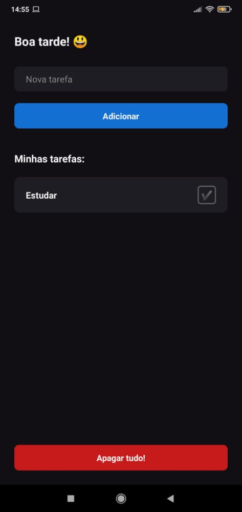

### :pushpin: Sobre o projeto:

Aplicativo para anotar tarefas feito com React Native

<p align="center">


</p>

Você pode baixar o app por este [link](https://play.google.com/store/apps/details?id=com.todolistbyth1ag0_zz).

### :rocket: Melhorias para fazer:
- [x] Adicionar AsyncStorage
- [x] Adicionar Typescript
- [ ] Dark/Light Mode

### :wrench: Tecnologias usadas:
- [React Native](https://reactnative.dev/)
- [Typescript](https://www.typescriptlang.org/)

### :building_construction: Como rodar na sua máquina?

Clone este repositório:
``` bash
git clone https://github.com/th1ag0-Zz/ToDo_List-App.git
```
Depois navegue até a pasta e abra no seu VsCode (ou seu editor de preferência)
``` bash
cd todoList

code .
```
<br />
Pronto! Agora você pode fazer suas modificações. 😃

### :memo: Licensa:
Este projeto está sob a licensa MIT. Clique [aqui](https://github.com/th1ag0-Zz/ToDo_List-App/blob/main/LICENSE.md) para saber mais.

---
Feito por [Thiago Silva](https://www.linkedin.com/in/thiago-furtado-silva/) 😁
